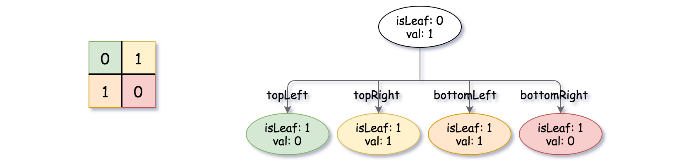
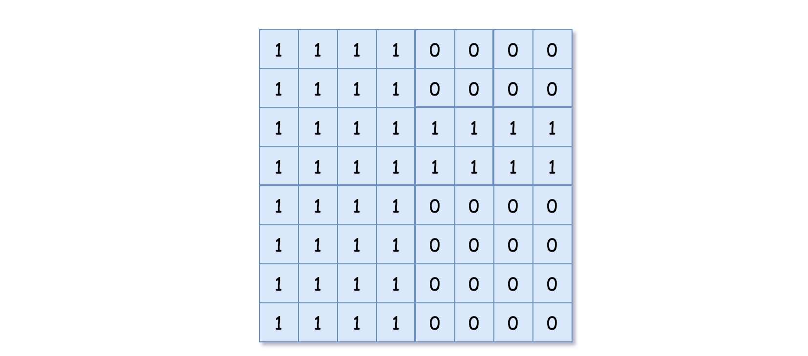
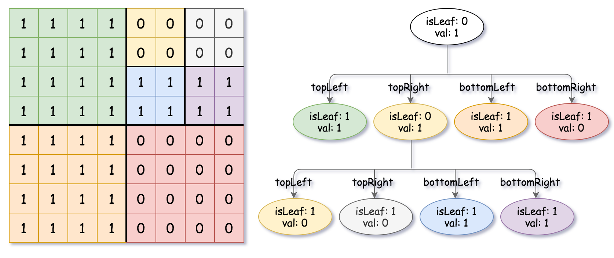

# 建立四叉树

给你一个 `n * n` 矩阵 `grid`，矩阵由若干 `0` 和 `1` 组成。请你用四叉树表示该矩阵，并返回四叉树的根节点。

四叉树数据结构中，每个内部节点只有四个子节点。此外，每个节点都有两个属性：

- `val`：叶子节点所代表区域的值，`1` 对应 True，`0` 对应 False。
  注意，当 `isLeaf` 为 False 时，`val` 可以取任意值，判题机制均接受。
- `isLeaf`：当节点是叶子节点时为 True，有四个子节点时为 False。

```java
class Node {
    public boolean val;
    public boolean isLeaf;
    public Node topLeft;
    public Node topRight;
    public Node bottomLeft;
    public Node bottomRight;
}
```

按以下步骤为二维区域构建四叉树：

1. 如果当前网格的值全部相同（全 `0` 或全 `1`），将 `isLeaf` 设为 True，`val` 设为对应值，四个子节点设为 null，停止。
2. 如果当前网格的值不同，将 `isLeaf` 设为 False，`val` 设为任意值，如下图所示将网格划分为四个子网格。
3. 使用适当的子网格递归每个子节点。


> 如需了解更多四叉树内容，可参考百科。

## 四叉树格式

输出为使用层序遍历后四叉树的序列化形式，其中 `null` 表示路径终止符。
节点以列表形式表示 `[isLeaf, val]`，True 表示为 `1`，False 表示为 `0`。

## 示例 1：


```
输入：grid = [[0,1],[1,0]]
输出：[[0,1],[1,0],[1,1],[1,1],[1,0]]
解释：请注意，在下面四叉树的图示中，0 表示 false，1 表示 True。
```



## 示例 2：



```
输入：grid = [[1,1,1,1,0,0,0,0],
              [1,1,1,1,0,0,0,0],
              [1,1,1,1,1,1,1,1],
              [1,1,1,1,1,1,1,1],
              [1,1,1,1,0,0,0,0],
              [1,1,1,1,0,0,0,0],
              [1,1,1,1,0,0,0,0],
              [1,1,1,1,0,0,0,0]]
输出：[[0,1],[1,1],[0,1],[1,1],[1,0],null,null,null,null,[1,0],[1,0],[1,1],[1,1]]
解释：网格中所有值都不相同，将网格划分为四个子网格。
     topLeft、bottomLeft 和 bottomRight 均具有相同的值。
     topRight 具有不同的值，因此继续划分为 4 个子网格。
```



## 提示：

- `n == grid.length == grid[i].length`
- `n == 2^x`，其中 `0 <= x <= 6`
