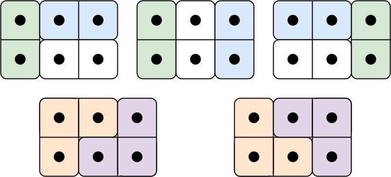
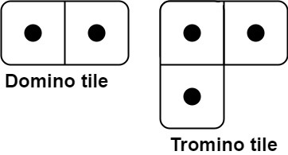

# 多米诺和托米诺平铺

有两种形状的瓷砖：一种是 `2 x 1` 的多米诺形，另一种是形如 `"L"` 的托米诺形。两种形状都可以旋转。



给定整数 `n` ，返回可以平铺 `2 x n` 的面板的方法的数量。返回对 `10^9 + 7` 取模 的值。

平铺指的是每个正方形都必须有瓷砖覆盖。两个平铺不同，当且仅当面板上有四个方向上的相邻单元中的两个，使得恰好有一个平铺有一个瓷砖占据两个正方形。

## 示例 1:



```
输入：n = 3
输出：5
解释：五种不同的方法如上所示。
```

## 示例 2:

```
输入：n = 1
输出：1
```

## 提示：

- `1 <= n <= 1000`

## 思路

双状态动态规划。设：

- `f[i]`：完整填满 `2 x i` 面板的方法数
- `p[i]`：填满 `2 x i` 面板但右上角缺一格的方法数（部分平铺）；缺右下角与之上下对称、方法数相同，参与转移时乘 2

递推（按末尾如何收尾拆解）：

- `f[i] = f[i-1] + f[i-2] + 2 * p[i-1]`
  - 末尾竖多米诺 → 前面 `f[i-1]`
  - 末尾两横多米诺 → 前面 `f[i-2]`
  - 末尾托米诺补缺角 → 缺角可在右上/右下，故 `2 * p[i-1]`
- `p[i] = p[i-1] + f[i-2]`
  - 末尾竖多米诺补一格、仍缺一角 → `p[i-1]`
  - 末尾托米诺从完整 `f[i-2]` 咬出一角 → `f[i-2]`

边界：`f[0]=1, f[1]=1, f[2]=2`；`p[0]=0, p[1]=0, p[2]=1`。

## 复杂度

- 时间 `O(n)`，空间 `O(n)`（数组版）/ `O(1)`（滚动变量版）

## 解法

- `Solution.java`：滚动变量版，`O(1)` 空间。变量 `y` 实际跟踪 `2·p`、`preX` 跟踪 `f(i-2)`，三变量滚动。
- `Solution2.java`：双状态数组版，`f`/`p` 语义显式，便于理解递推。
