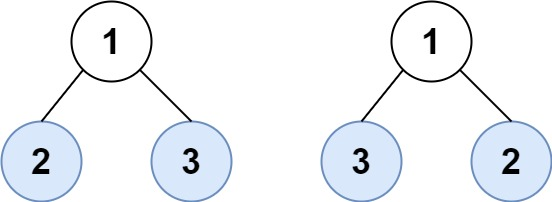

# 叶子相似的树

请考虑一棵二叉树上所有的叶子，这些叶子的值按从左到右的顺序排列形成一个叶值序列。
如果两棵二叉树的叶值序列相同，则认为它们叶相似。




## 示例 1：

```text
输入：root1 = [3,5,1,6,2,9,8,null,null,7,4], root2 = [3,5,1,6,7,4,2,null,null,null,null,null,null,9,8]
输出：true
```

## 示例 2：

```text
输入：root1 = [1,2,3], root2 = [1,3,2]
输出：false
```

## 提示：

- 两棵树的节点数在 `[1, 200]` 范围内
- 节点值在 `[0, 200]` 范围内
