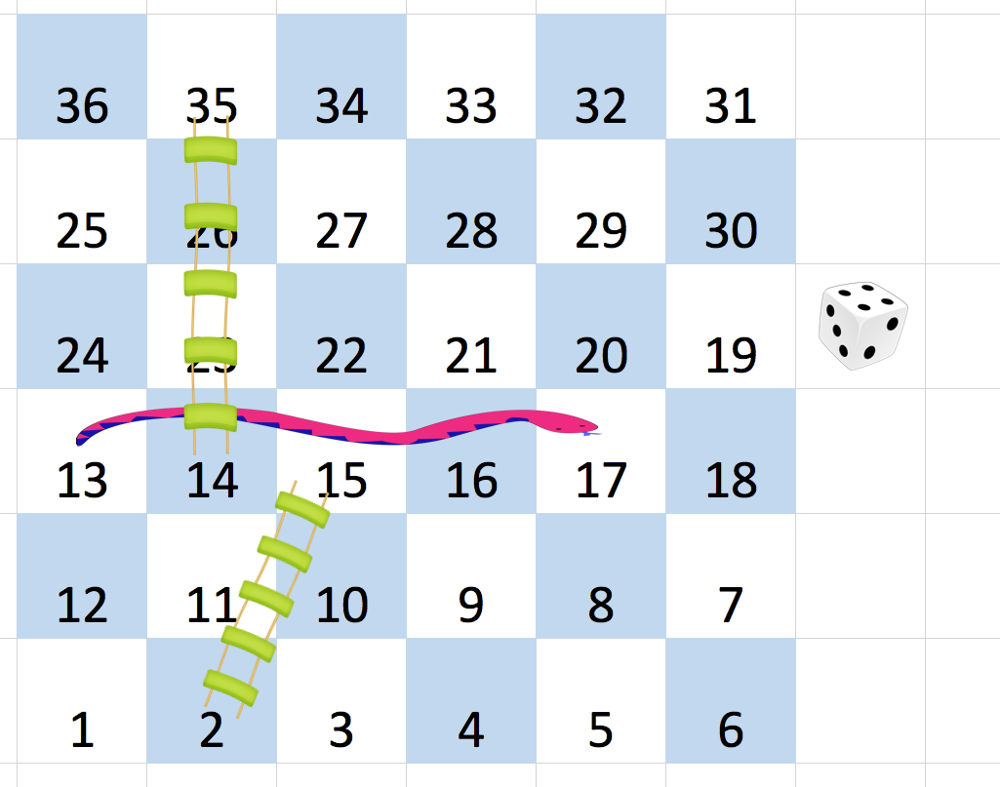

# 蛇梯棋

给你一个大小为 `n x n` 的整数矩阵 `board`，方格按从 `1` 到 `n²` 编号，
编号遵循**转行交替方式**，从左下角开始（即从 `board[n-1][0]` 开始）的每一行改变方向。

你一开始位于棋盘上的方格 `1`。每一回合，玩家需要从当前方格 `curr` 出发：

- 选定目标方格 `next`，编号在范围 `[curr+1, min(curr+6, n²)]`（模拟掷六面体骰子）
- 如果目标方格 `next` 处存在蛇或梯子（即 `board[r][c] != -1`），
  玩家传送到 `board[r][c]`；否则传送到 `next`
- 每次掷骰最多经过一次蛇或梯子，不能连续跳多个路径
- 到达编号 `n²` 的方格时游戏结束

返回达到编号为 `n²` 的方格所需的**最少掷骰次数**，如果不可能则返回 `-1`。

> 编号为 `1` 和 `n²` 的方格上没有蛇或梯子。

## 示例 1：



```
输入：board = [[-1,-1,-1,-1,-1,-1],
               [-1,-1,-1,-1,-1,-1],
               [-1,-1,-1,-1,-1,-1],
               [-1,35,-1,-1,13,-1],
               [-1,-1,-1,-1,-1,-1],
               [-1,15,-1,-1,-1,-1]]
输出：4
解释：
  1 → 2（梯子）→ 15 → 17（蛇）→ 13 → 14（梯子）→ 35 → 36
  共 4 次掷骰。
```

## 示例 2：

```
输入：board = [[-1,-1],[-1,3]]
输出：1
```

## 提示：

- `n == board.length == board[i].length`
- `2 <= n <= 20`
- `board[i][j]` 的值是 `-1` 或在范围 `[1, n²]` 内
- 编号为 `1` 和 `n²` 的方格上没有蛇或梯子
