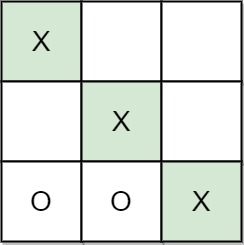
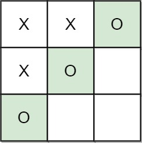
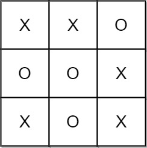

# 找出井字棋的获胜者

**井字棋** 是由两个玩家 `A` 和 `B` 在 `3 x 3` 的棋盘上进行的游戏。
井字棋游戏的规则如下：

- 玩家轮流将棋子放在空方格（`' '`）上。
- 第一个玩家 `A` 总是用 `'X'` 作为棋子，而第二个玩家 `B` 总是用 `'O'` 作为棋子。
- `'X'` 和 `'O'` 只能放在空方格中，而不能放在已经被占用的方格上。
- 只要有 **3** 个相同的（非空）棋子排成一条直线（行、列、对角线）时，游戏结束。
- 如果所有方块都放满棋子（不为空），游戏也会结束。
- 游戏结束后，棋子无法再进行任何移动。

给你一个数组 `moves`，其中 `moves[i] = [row_i, col_i]` 表示第 `i` 次移动在
`grid[row_i][col_i]`。如果游戏存在获胜者（`A` 或 `B`），就返回该游戏的获胜者；
如果游戏以平局结束，则返回 `"Draw"`；如果仍会有行动（游戏未结束），则返回 `"Pending"`。

> 你可以假设 `moves` 都 **有效**（遵循 **井字棋** 规则），网格最初是空的，`A` 将先行动。

## 示例 1：



```
输入：moves = [[0,0],[2,0],[1,1],[2,1],[2,2]]
输出："A"
解释："A" 获胜，他总是先走。
```

## 示例 2：



```
输入：moves = [[0,0],[1,1],[0,1],[0,2],[1,0],[2,0]]
输出："B"
解释："B" 获胜。
```

## 示例 3：



```
输入：moves = [[0,0],[1,1],[2,0],[1,0],[1,2],[2,1],[0,1],[0,2],[2,2]]
输出："Draw"
解释：由于没有办法再行动，游戏以平局结束。
```

## 提示：

- `1 <= moves.length <= 9`
- `moves[i].length == 2`
- `0 <= moves[i][j] <= 2`
- `moves` 里没有重复的元素。
- `moves` 遵循井字棋的规则。
