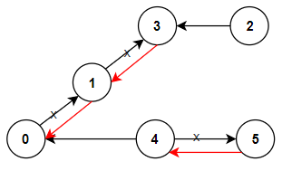

# 重新规划路线

有 `n` 座城市，编号为 `0` 到 `n - 1`，其间共有 `n - 1` 条路线。因此，任意两座不同城市之间只有唯一一条路径，路线网形成一棵树。

路线用 `connections` 表示，其中 `connections[i] = [a, b]` 表示一条从城市 `a` 到城市 `b` 的有向路线。

城市 `0` 将举办大型比赛。请重新规划路线方向，使每个城市都可以访问城市 `0`，并返回需要变更方向的最小路线数。

题目保证重新规划后每个城市都能到达城市 `0`。

## 示例 1：

```text
输入：n = 6, connections = [[0,1],[1,3],[2,3],[4,0],[4,5]]
输出：3
解释：更改以红色显示的路线方向，使每个城市都可以到达城市 0。
```



## 示例 2：

```text
输入：n = 5, connections = [[1,0],[1,2],[3,2],[3,4]]
输出：2
解释：更改以红色显示的路线方向，使每个城市都可以到达城市 0。
```


## 示例 3：

```text
输入：n = 3, connections = [[1,0],[2,0]]
输出：0
```

## 提示：

- `2 <= n <= 5 * 10^4`
- `connections.length == n - 1`
- `connections[i].length == 2`
- `0 <= connections[i][0], connections[i][1] <= n - 1`
- `connections[i][0] != connections[i][1]`
