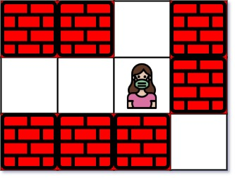
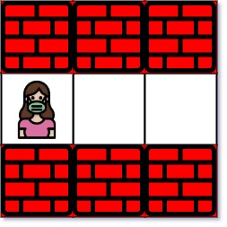
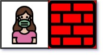

# 1926. 迷宫中离入口最近的出口

给你一个 `m x n` 的迷宫矩阵 `maze`（下标从 `0` 开始），矩阵中有空格子和墙。空格子用 `'.'` 表示，墙用 `'+'` 表示。同时给你迷宫的入口 `entrance`，用 `entrance = [row, col]` 表示你一开始所在格子的行和列。

每一步操作，你可以往上、下、左或右移动一个格子。你不能进入有墙的格子，也不能移出迷宫。你的目标是找到离入口最近的出口。出口的含义是在迷宫边界上的空格子。入口格子不算出口。

请你返回从入口到最近出口的最少移动次数。如果不存在这样的出口，请返回 `-1`。

## 示例 1

```text
输入：maze = [["+","+",".","+"],[".",".",".","+"],["+","+","+","."]], entrance = [1,2]
输出：1
```



## 示例 2

```text
输入：maze = [["+","+","+"],[".",".","."],["+","+","+"]], entrance = [1,0]
输出：2
```



## 示例 3

```text
输入：maze = [[".","+"]], entrance = [0,0]
输出：-1
```



## 提示

- `maze.length == m`
- `maze[i].length == n`
- `1 <= m, n <= 100`
- `maze[i][j]` 是 `'.'` 或者 `'+'`。
- `entrance.length == 2`
- `0 <= entrance_row < m`
- `0 <= entrance_col < n`
- `entrance` 一定是空格子。
